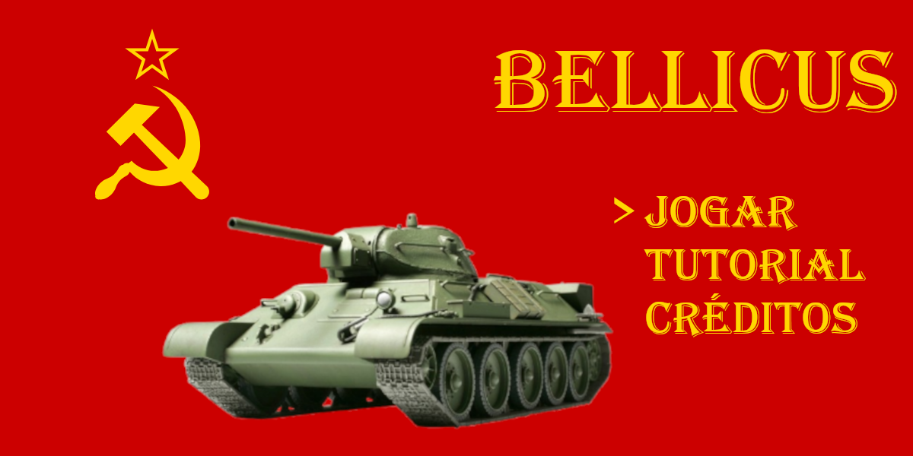
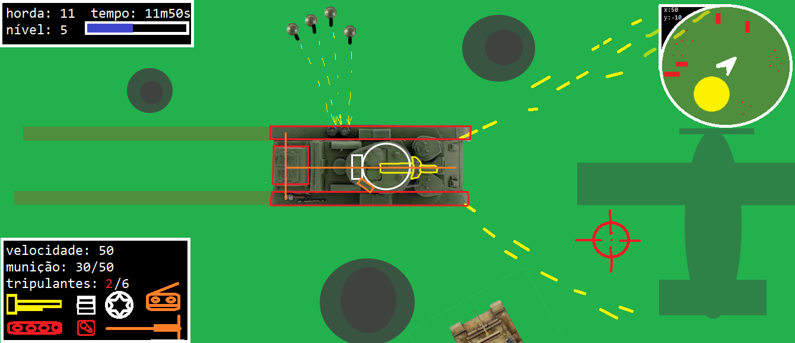
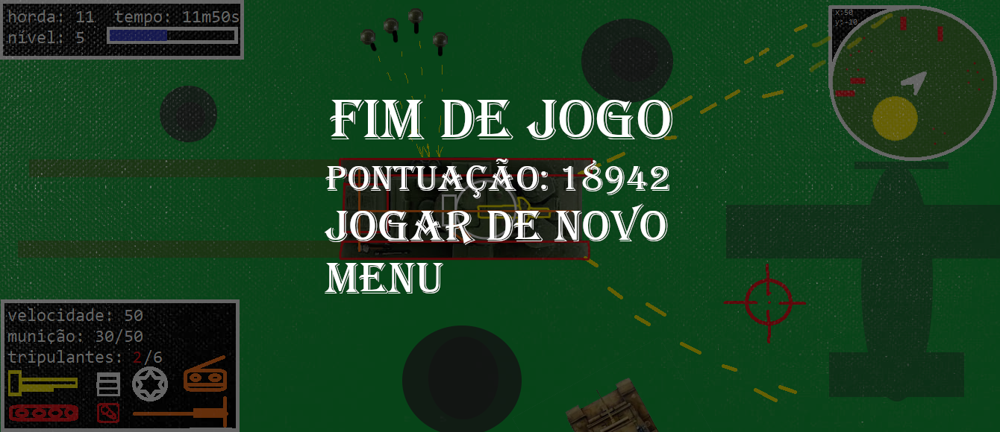

# 1. Qual o nome do projeto?

## Bellicus

# 2. Qual o tipo do projeto? É um jogo? Qual tipo de jogo?

## É um jogo com uma mecânica "shooting and run" de tanques, com visão top-down.

# 3. Descreva o projeto em um parágrafo:

## Combate contra horda de inimigos, controle de munição, ganho de XP | Objetivo: sobreviver pelo máximo de tempo possível.

# 4. Qual parte do projeto é especial?

## Mecânica baseada em clássicos dos anos 70 e 80, baseados em conflitos de tanques da 2º Guerra Mundial e com progressão por rodadas de waves.

